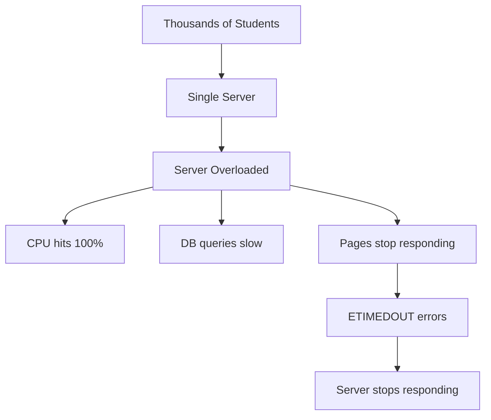

# 🌐 Learning from Website Performance Issues - Q&A Guide

## 📋 Table of Contents
1. [Website Performance Analysis](#-q1-website-performance-analysis)
2. [Backend Engineering Lessons](#-q2-backend-engineering-lessons)
3. [Scalable System Design](#-q3-scalable-system-design)
4. [Developer Learning Path](#-q4-developer-learning-path)
5. [Key Takeaways](#-q5-key-takeaways)

---

## 🔍 **Q1: Website Performance Analysis**

### **Q: How many requests can results.beup.ac.in handle?**

**A: Realistically? Very few - approximately 20-50 requests per second maximum.**

#### **Why is the capacity so low?**

State result portals like BEU/BEUP (government university sites) typically have:

| Issue | Description |
|-------|-------------|
| 🖥️ **Basic Servers** | Hosted on very basic, underpowered servers |
| 🌐 **No CDN** | No Content Delivery Network for global distribution |
| 💾 **No Caching** | Missing caching layer for frequently accessed data |
| ⚖️ **No Load Balancer** | Single server handling all traffic |
| 🔧 **Outdated Tech** | Sometimes run on outdated IIS/Apache/PHP |
| 📈 **Not Optimized** | No optimization for high traffic scenarios |

#### **What happens during result day?**



**Common Error Messages:**
- `ETIMEDOUT` - Server timeout
- `NO_RESPONSE` - Server not responding
- `Server hang` - Complete unresponsiveness

---

## 🎓 **Q2: Backend Engineering Lessons**

### **Q: What can you learn from observing this failure?**

**A: You can learn real backend engineering concepts by understanding why this happens and how to prevent it.**

### **A. Why High-Traffic Sites Don't Crash**

#### **Big Sites (YouTube, Amazon, Google, IRCTC) vs BEUP:**

| **High-Traffic Sites Use** | **BEUP Site Has** |
|---------------------------|-------------------|
| ✅ Load Balancer | ❌ Single Server |
| ✅ CDN (Global Distribution) | ❌ No CDN |
| ✅ Multi-layer Caching | ❌ No Caching |
| ✅ Multiple Servers | ❌ One Server |
| ✅ Horizontal Scaling | ❌ Fixed Capacity |
| ✅ Rate Limiting | ❌ No Protection |
| ✅ Reverse Proxy (Nginx) | ❌ Basic Setup |
| ✅ Database Indexing | ❌ Poor DB Performance |
| ✅ Message Queues | ❌ Synchronous Processing |

### **B. Server Breakdown Process**

#### **What happens inside the server during overload?**

```
🚀 Normal State → 📈 Traffic Spike → 💥 System Breakdown
```

**Step-by-step breakdown:**

1. **Initial Load Increase**
   - CPU usage starts climbing
   - RAM consumption increases

2. **Resource Saturation**
   - CPU usage spikes to 90%+
   - RAM fills up completely
   - Threads get blocked

3. **Database Performance Degradation**
   - Queries take longer to execute
   - Connection pool exhausted
   - Deadlocks start occurring

4. **Request Queue Buildup**
   - Requests start queuing up
   - Response times increase dramatically

5. **Server Response Failure**
   - Server starts sending error codes:
     - `503 Service Unavailable`
     - `504 Gateway Timeout`
   - Finally stops responding entirely (`ETIMEDOUT`)

---

## 🏗️ **Q3: Scalable System Design**

### **Q: How do you design a website that NEVER goes down?**

**A: Implement a multi-layer architecture with redundancy and scalability built-in.**

### **Essential Components for Scalable Systems:**

#### **1. 🔄 Load Balancer**
```
Users → Load Balancer → Server 1
                    └→ Server 2
                    └→ Server 3
```
**Purpose:** Distribute traffic across multiple servers

#### **2. 🌍 CDN (Content Delivery Network)**
```
User in India → CDN Mumbai → Static Files
User in USA → CDN New York → Static Files
```
**Purpose:** Serve static content globally with low latency

#### **3. 💾 Multi-Level Caching**

| Cache Type | Purpose | Example |
|------------|---------|---------|
| **Browser Cache** | Client-side caching | CSS, JS, Images |
| **CDN Cache** | Edge server caching | Static content |
| **Application Cache** | Server memory | Frequent queries |
| **Database Cache** | Query result caching | Redis, Memcached |

#### **4. 📈 Horizontal Scaling**
```
Low Traffic:  [Server 1]
High Traffic: [Server 1] + [Server 2] + [Server 3] + ...
```
**Auto-scaling:** Add servers automatically when traffic increases

#### **5. 🗄️ Database Optimization**

**Techniques:**
- **Indexing:** Fast data retrieval
- **Query Optimization:** Efficient database operations
- **Connection Pooling:** Manage database connections
- **Read Replicas:** Separate read and write operations

#### **6. 🚦 Rate Limiting**
```javascript
// Example: Allow only 100 requests per minute per user
app.use('/api', rateLimit({
  windowMs: 60 * 1000, // 1 minute
  max: 100 // limit each IP to 100 requests per windowMs
}));
```

#### **7. 📬 Queue Processing**
```
User Request → Queue → Background Worker → Database
```
**Tools:** RabbitMQ, Kafka, Redis Queue

---

## 📚 **Q4: Developer Learning Path**

### **Q: As a backend developer, what should you study from this?**

**A: Here's a comprehensive roadmap based on real-world scenarios like this:**

### **Phase 1: HTTP & Network Fundamentals** 🌐

#### **Learn HTTP Error Handling**
```javascript
// Understanding different error types
try {
  const response = await axios.get('https://results.beup.ac.in');
} catch (error) {
  if (error.code === 'ETIMEDOUT') {
    console.log('Server timeout - no response received');
  } else if (error.code === 'ECONNRESET') {
    console.log('Connection reset by server');
  } else if (error.code === 'ENOTFOUND') {
    console.log('Domain not found');
  }
}
```

**Key Concepts:**
- `ETIMEDOUT` - Server didn't respond within timeout
- `ECONNRESET` - Server forcibly closed connection
- `ENOTFOUND` - DNS resolution failed
- Why Axios throws errors without HTTP status codes

### **Phase 2: Server Architecture** ⚙️

#### **Study Different Server Models**

| Server Type | How it Works | Examples |
|-------------|--------------|----------|
| **Single-threaded** | Event loop, non-blocking I/O | Node.js |
| **Multi-threaded** | Thread per request | Apache HTTP |
| **Event-driven** | Async event handling | Nginx |

#### **Understanding Server Components**
```javascript
// Node.js Event Loop example
console.log('Start');
setTimeout(() => console.log('Timeout'), 0);
setImmediate(() => console.log('Immediate'));
console.log('End');

// Output order demonstrates event loop behavior
```

### **Phase 3: Load Testing & Performance** 📊

#### **Load Testing Tools**

**1. K6 (Recommended)**
```javascript
import http from 'k6/http';
import { check } from 'k6';

export let options = {
  stages: [
    { duration: '30s', target: 20 },
    { duration: '1m', target: 50 },
    { duration: '30s', target: 0 },
  ],
};

export default function() {
  let response = http.get('https://test-api.com');
  check(response, {
    'status is 200': (r) => r.status === 200,
    'response time < 500ms': (r) => r.timings.duration < 500,
  });
}
```

**2. Apache JMeter**
- GUI-based load testing
- Complex scenarios
- Detailed reporting

**3. Artillery (Node.js)**
```yaml
config:
  target: 'https://api.example.com'
  phases:
    - duration: 60
      arrivalRate: 10

scenarios:
  - name: "Load test"
    flow:
      - get:
          url: "/users"
```

#### **Key Metrics to Monitor**

| Metric | Description | Good Value |
|--------|-------------|------------|
| **RPS** | Requests Per Second | Depends on use case |
| **Latency** | Response time | < 200ms for APIs |
| **Throughput** | Data transferred | High as possible |
| **Error Rate** | Failed requests % | < 1% |

### **Phase 4: Scalable System Implementation** 🚀

#### **Nginx Reverse Proxy Setup**
```nginx
upstream backend {
    server 127.0.0.1:3000;
    server 127.0.0.1:3001;
    server 127.0.0.1:3002;
}

server {
    listen 80;
    location / {
        proxy_pass http://backend;
        proxy_set_header Host $host;
        proxy_set_header X-Real-IP $remote_addr;
    }
}
```

#### **Redis Caching Implementation**
```javascript
const redis = require('redis');
const client = redis.createClient();

// Cache frequently accessed data
async function getUserData(userId) {
  const cacheKey = `user:${userId}`;
  
  // Try cache first
  let userData = await client.get(cacheKey);
  
  if (!userData) {
    // If not in cache, get from database
    userData = await database.getUser(userId);
    
    // Store in cache for 1 hour
    await client.setex(cacheKey, 3600, JSON.stringify(userData));
  }
  
  return JSON.parse(userData);
}
```

#### **Docker + Kubernetes Scaling**
```yaml
# kubernetes-deployment.yaml
apiVersion: apps/v1
kind: Deployment
metadata:
  name: web-app
spec:
  replicas: 3
  selector:
    matchLabels:
      app: web-app
  template:
    spec:
      containers:
      - name: web-app
        image: my-app:latest
        resources:
          requests:
            memory: "256Mi"
            cpu: "250m"
          limits:
            memory: "512Mi"
            cpu: "500m"
```

---

## 🎯 **Q5: Key Takeaways**

### **Q: What are the most important lessons from this BEUP website analysis?**

**A: Here are the critical takeaways that every backend developer should understand:**

### **📈 Real-World Learning Summary**

| **Concept** | **What You Learned** | **Why It Matters** |
|-------------|---------------------|-------------------|
| **Server Timeout** | Server didn't respond to requests | Understanding error handling in production |
| **Overload Symptoms** | Too many requests crash servers | Importance of capacity planning |
| **Architecture Matters** | No scaling/caching = failure | Good architecture prevents disasters |
| **Traffic Scaling** | High traffic = website crash without proper setup | Need for horizontal scaling |
| **Error Behavior** | Axios throws errors without status codes when server is unreachable | Proper error handling in applications |
| **Infrastructure Impact** | Not just coding, but infrastructure design matters | Full-stack thinking required |

### **🔧 Practical Implementation Checklist**

**When building your own systems, ensure:**

- [ ] **Load Testing:** Test your system before going live
- [ ] **Caching Layer:** Implement Redis/Memcached
- [ ] **Database Optimization:** Proper indexing and queries
- [ ] **Error Handling:** Graceful degradation
- [ ] **Monitoring:** Real-time performance tracking
- [ ] **Auto-scaling:** Handle traffic spikes automatically
- [ ] **Rate Limiting:** Prevent abuse and overload

### **🚀 Next Steps for Advanced Learning**

#### **Want to dive deeper? Here's what you can explore:**

1. **✅ Load Testing Deep Dive**
   - How to properly load-test websites without attacking them
   - Capacity planning and performance benchmarking
   - Identifying bottlenecks and optimization points

2. **✅ Server Capacity Analysis**
   - Tools to check server specifications
   - Performance monitoring and alerting
   - Resource utilization optimization

3. **✅ Building Crash-Proof Systems**
   - Design a result portal that handles millions of users
   - Implementing fault tolerance and redundancy
   - Disaster recovery planning

4. **✅ High-Traffic Simulation**
   - Simulate 10,000+ concurrent users
   - Chaos engineering principles
   - Performance testing automation

5. **✅ Professional Architecture Design**
   - How BEUP should properly architect their system
   - Cost-effective scaling strategies
   - Government-grade security and compliance

---

## 💡 **Pro Tip**

> This single `ETIMEDOUT` error from the BEUP website is a goldmine for learning backend concepts. It's a perfect real-world example of how poor architecture fails under pressure. Use this as a reference point when designing your own systems - ask yourself: "Would my system handle the BEUP result day traffic better?"

---

**📚 Want to learn more?** Each of these topics can be expanded into detailed tutorials with hands-on examples and real-world implementations!